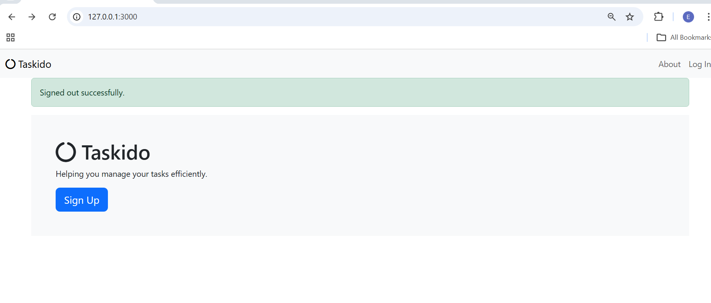
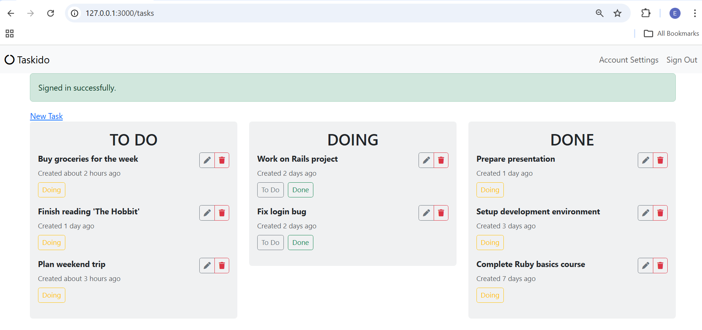

# Taskido - A Simple Task Management App

Taskido is a task management application built with Ruby on Rails 8. It allows users to create, manage, and organize tasks in three states: To Do, Doing, and Done.

## Features

- User authentication with Devise
- Create, edit, and delete tasks
- Organize tasks by state (To Do, Doing, Done)
- Move tasks between states with one click
- Responsive design with Bootstrap 5
- Font Awesome icons for better UX
- Turbo-powered updates for smooth interactions

## Screenshots

## Tech Stack

- **Ruby** 3.x
- **Rails** 8.x
- **Database**: SQLite (development), PostgreSQL (production)
- **Authentication**: Devise
- **Frontend**: Bootstrap 5, Font Awesome
- **JavaScript**: Turbo

## Prerequisites

- Ruby 3.0 or higher
- Rails 8.0 or higher
- SQLite3 (for development)

